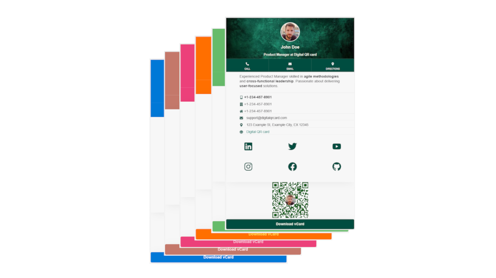
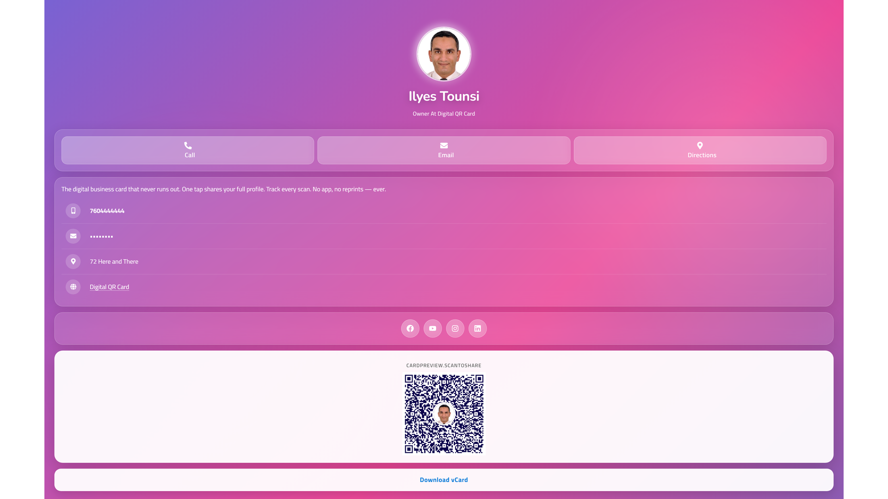
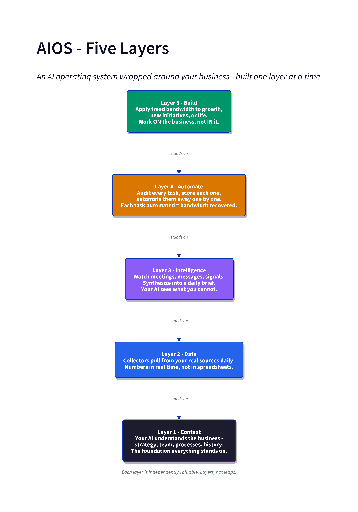
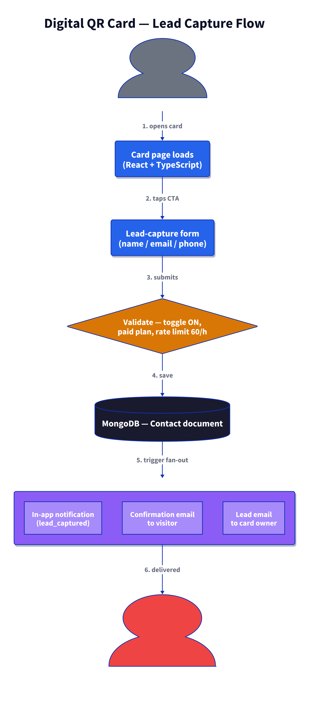
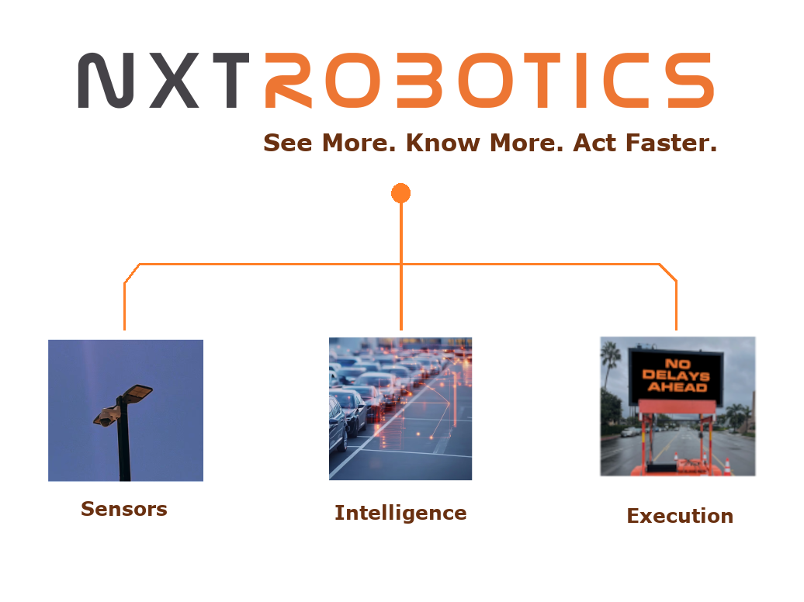
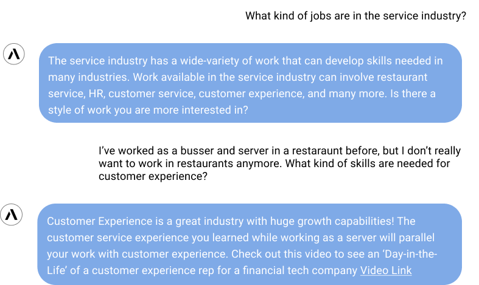

# Mohamed Ilyes Tounsi

**Full-Stack Software Engineer · AI/ML Integrator · Founder**

Carlsbad, CA, USA · +1 7604814120 · tounsils@gmail.com
[linkedin.com/in/mohameditounsi](https://linkedin.com/in/mohameditounsi) · [github.com/tounsils](https://github.com/tounsils) · [digitalqrcard.com](https://www.digitalqrcard.com)

## Professional Summary

Full-stack software engineer and engineering leader with 20+ years of experience shipping production web platforms end-to-end — architecture, backend APIs, cloud infrastructure, frontend, data pipelines, and CI/CD. Over the last three years I've layered **AI/ML integration** on top of that foundation: LLM applications, RAG pipelines, MCP-based agent orchestration, voice, semantic search, and human-in-the-loop workflows. Current focus splits across a fractional senior engineering role at NXT Robotics (~60%), an advisory VP-of-Engineering role at AIMIA (~20%), part-time engineering at Hydrostasis (~20%), and solo-founder work on [digitalqrcard.com](https://www.digitalqrcard.com).

I'm a **software engineer first**. AI is a tool in the stack, not the whole stack.

## Core Skills

**Languages & Frameworks** — TypeScript, JavaScript, Python, PHP, Go (reading), Node.js, React 18, Next.js 15, Vite, FastAPI, Express, Hono, Fastify, Laravel, GraphQL, REST.

**Frontend** — React, Next.js, Vite, Tailwind CSS, Radix UI, Chakra UI, TanStack Router/Query, styled-components, CustomTkinter (desktop), responsive design systems.

**Backend & Cloud** — Node.js, Python (FastAPI, Django), Docker, Kubernetes, AWS (ECS, EC2, S3, CloudFront, Route 53, Lambda, CloudFormation, EventBridge, Secrets Manager), Vercel, Railway, Neon, Supabase, GitHub Actions.

**Data & Storage** — PostgreSQL, MongoDB, ChromaDB, Firestore, SQLite, Drizzle ORM, Prisma, ETL pipelines, data modeling, vector embeddings.

**AI/ML Integration** — Anthropic Claude SDK, OpenAI, Google Vertex AI / Gemini, Groq, ElevenLabs voice, HuggingFace embeddings, MCP (Model Context Protocol) orchestration, RAG pipelines, semantic search, human-in-the-loop workflows, weak-supervision labeling.

**Testing & Quality** — TDD, Jest, PHPUnit, Autocannon (load testing), unit / integration testing, code review at scale.

**Delivery & Leadership** — Agile/Scrum, Jira, ClickUp, Asana, distributed team leadership, mentoring, code review at scale.

## Experience

### Senior Software Engineer — NXT Robotics (Remote) · Fractional (~60%) · 2025 – Present
- Build and maintain **RobotogoAI** — the operator SaaS console + agent layer that turns raw device telemetry (video, GPS, battery, BLE beacons) into actionable ops decisions for physical-security and field-equipment fleets — stadium venues (ACE / Snapdragon Stadium, Petco Park), EV-charging networks, drone operators, and a 300+ site parking pilot.
- Ship end-to-end operator-console features: alerts UI with severity taxonomy + deep-link, checklists module, camera-picker video streams with iOS black-tile fix, mobile swipeable single-camera carousel + battery graph, tenant-themed dashboards.
- LiveKit voice/video + ElevenLabs + react-speech-recognition cockpit voice interface; AI Assist wired to an AWS Bedrock supervisor agent across multiple production tenants.
- Backend feature work: BLE beacon CRUD, editable gateway coverage radius, geofence-move alerts, battery-low threshold service with clamp-safe firing, `PruneTelemetry` retention command, drone-partner heartbeat + bounded event sync.
- Built the **executive operations console** — a configurable metric-card system with an auditable vendor ledger, ⌘K categorized search, drag-to-reorder, Trello & Monday board integrations, Cognito SRP auth migration, admin `/team` route with invite modal + inline role editor.
- Founded and structured the shared human + AI-agent knowledge repository (Docsify site, structured frontmatter schema, ADR adoption).
- **Stack:** React 19, Redux Toolkit + Saga, Ant Design, Vite, LiveKit, HLS.js, Recharts / Chart.js, react-leaflet, PHP 8.3 + Laravel 12 + Passport, MySQL/RDS, RabbitMQ / MQTT, Python + AWS SAM/CloudFormation, ECS + RDS + ALB, Node 20 + TypeScript + esbuild, AWS Lambda + API Gateway + Aurora Serverless v2 + Cognito, ElevenLabs, AWS Bedrock, Docker.

### VP of Engineering (Advisory, Part-time ~20%) — AIMIA (Remote) · San Diego, CA · 2025 – Present
- Own end-to-end engineering for an AI-driven career + AI-literacy assessment platform (aimia.me) serving students, young professionals, and adult learners — with institutional partners including Irvine Valley College, MIT, Palomar College, and Mission Edge.
- Architect a **multi-agent Gemini stack**: 6 specialized agents + supervisor produce a Career Summary + Top-3 Career Paths from a conversational RIASEC / skills / values / personality assessment, paired with a 48-question AI Proficiency Assessment across 6 domains that issues a shareable public certificate.
- Ship **Gemini Live** bidirectional voice over WebSocket + ElevenLabs voice fallback; multilingual UX + LLM output (English, zh-TW, zh-HK, Spanish); length-bias / anti-cheat detector that retries generation when the model systematically writes longer correct answers.
- Own security posture: application-layer **AES-256-GCM** Mongoose field encryption with HMAC-SHA256 blind-index email dedupe; JWT cookie + bearer access tokens; PostHog analytics with COPPA / FERPA masking; Sentry observability.
- Lead in-flight **AWS ECS Fargate → GCP Cloud Run** migration (ECR/ALB/Route 53/Secrets Manager → Cloud Run / Cloud DNS / Secret Manager); per-service GitHub Actions CI/CD.
- Ship admin console: live Gemini model discovery + smoke-test switcher, attempt inspection, contact CSV export, encryption backfill utility.
- **Stack:** Next.js 15 (Pages Router), React 18, Redux Toolkit, Tailwind v4, Express + TypeScript, Mongoose 7, FastAPI (Python 3.11), Google Vertex AI / Gemini + Gemini Live, ElevenLabs, MongoDB Atlas, AWS (ECS Fargate, ECR, ALB, Route 53, Secrets Manager) → GCP (Cloud Run, Cloud DNS, Secret Manager), GitHub Actions, Docker, Sentry, PostHog.

### Founder & Principal Engineer — TN76 Digital (formerly Web & Carto) · Carlsbad, CA · 2011 – Present
- Independent consulting practice. Run part-time alongside full-time engineering employment through 2022, then as a primary practice after relocating to California.
- Design and deliver geospatial and full-stack solutions end to end: needs assessment, system and data architecture, workflow optimization, integration with existing client systems, training and support.
- Provide technical leadership, mentoring client-side developers on architecture patterns and coding standards.
- **Stack:** JavaScript, TypeScript, PHP, Node.js, React, REST APIs, QGIS, Esri ArcGIS Enterprise Geo DB, PostgreSQL/PostGIS, MySQL, Docker.

### Software Engineering Manager — Zembra (Remote) · San Diego, CA · Sep 2024 – Nov 2024
- Led a fullstack team of 6 delivering core platform features Agile-style.
- Architected web apps and REST APIs using Node.js, React, PHP, SQL.
- Scrum Master; facilitated sprints and cross-team collaboration.

### Enterprise GIS Architect — geoConvergence (Remote) · Bloomington, IN · Nov 2023 – Apr 2024
- Architected high-availability GIS solutions and microservices on AWS (Lambda, CloudFormation, EventBridge).
- Ensured reliability, scalability, and secure deployment of data pipelines and GIS applications.
- **Stack:** AWS, PostgreSQL, Esri ArcGIS, Docker, CloudFormation, EventBridge.

### Lead Software Engineer — Tunisian Ministry of National Defense · Tunis · Apr 2017 – Sep 2022
- Led the software engineering team in an agile environment, owning technical design and system architecture across projects.
- Directed the "Intelligence Data Lake" — consolidated disparate sources into a real-time analytics dashboard with interactive geospatial visualizations for decision-makers.
- Owned production infrastructure setup and local development environments; produced data dictionaries and business-logic documentation.
- Enforced code quality through code review, unit testing, and pair programming; balanced new feature delivery against defects and technical debt.
- Mentored engineers in technology, architecture, and delivery; ran planning, task breakdown, and user-story writing.
- Held the rank of Colonel; managed engineering delivery and team performance alongside the technical role.
- **Stack:** PHP, JavaScript, REST APIs, MySQL, Leaflet.js, Esri ArcGIS Online, GPS/telemetry, ETL pipelines.

### Senior Software Engineer — Tunisian Ministry of National Defense · Tunis · Jun 2012 – Apr 2017
- Led development of complex GIS solutions from concept through release, including requirements definition and design.
- Converted business requirements into functional use cases and technical designs with client stakeholders; ran project review meetings.
- Built proof-of-concept GIS demos to validate approaches before committing to build.
- Reduced production cost by developing tooling that streamlined repetitive tasks in the SDLC.
- **Stack:** PHP, JavaScript, MySQL, Apache, Leaflet.js, Esri ArcGIS Enterprise & Server, ArcGIS Model Builder, Python scripting, geoprocessing, REST APIs, HTML/CSS.

### Software Engineer — National Center for Mapping & Remote Sensing (CNCT) · Tunis · Jun 2002 – Jun 2012
- First professional engineering role. Started as a GIS analyst and junior software engineer, then contributed to full-cycle delivery of nationwide GIS solutions.
- Built a health/medical mapping system directing patients to the appropriate service or regional hospital, and an agricultural map portal serving officials and local farmers.
- Contributed to agile development sprints: new features, bug fixes, and unit tests; provided technical support for assigned applications.
- **Stack:** PHP, Visual Basic, JavaScript, MySQL, Esri ArcGIS & ArcGIS Server, Leaflet.js, REST APIs, Python scripting, geoprocessing.

## Featured Project — Digital QR Card ([digitalqrcard.com](https://www.digitalqrcard.com))

**Solo founder & operator.** B2C business selling customizable QR-based digital business cards with **built-in lead capture** — the differentiator vs Popl / HiHello / Linq / Blinq / Mobilo, all of which treat the card as the product. We treat the *connection* as the product.

> **Master hook:** *"Every scan becomes a lead."*
> **Primary audience (last 90 days):** Real estate agents — open houses, listing presentations, walk-through follow-up.

### The product

Every card is fully customizable — theme, color, layout, socials, QR — and lives at a persistent URL so the info never goes stale.

The scan target: a live, mobile-first profile card with call / email / directions actions, socials, vCard download, and (the moat) an active lead-capture form.

### System architecture

The platform is more than the product page — it's a modular **AI Operating System (AIOS)** wrapped around the business. Five layers, installed one at a time:

{: .diagram-large}

| Layer | Responsibility |
|---|---|
| **Context** | Machine-readable business truth (strategy, offers, brand, personal info). Every AI session boots with `/prime` to load it. |
| **Data** | Daily collectors pull real numbers from analytics, Stripe, Shopify, ad platforms. |
| **Intelligence** | Meetings, messages, and signals synthesized into a daily brief. |
| **Automate** | Every recurring task audited, scored, and automated one at a time. |
| **Build** | Freed bandwidth applied to growth, product, and net-new initiatives. |

### Lead-capture flow — the moat

Every scan of a Digital QR Card lands on a personalized profile with an *active* lead-capture form (vs the passive vCard download every competitor ships). The lead flows straight into the owner's inbox and CRM.

{: .diagram-large}

### What I built (technical)

- **Product surface:** React + TypeScript customizable card builder; QR renderer; profile page with lead-capture form; Stripe checkout; MongoDB-backed profiles.
- **AIOS runtime:** Claude-Code-driven modular workspace — slash commands (`/prime`, `/install`, `/create-plan`, `/implement`, `/share`, `/deck`, `/youtube-screencast`) that operate on context files, plans, and outputs stored in the repo.
- **Diagram engine:** D2 source files rendered to PNG for docs, decks, and this résumé — same PNGs embedded above.
- **Content pipeline:** YouTube-first content system, 9 pieces/week across LinkedIn / IG / TikTok / Facebook, with a `writing-style` skill enforcing anti-AI-slop copy.
- **Deck builder:** Marp-based Markdown-to-PPTX pipeline branded to digitalqrcard.com.
- **Guardrails:** `human-in-the-loop by default`, `local data by default`, `borrow before you build` — encoded as workspace principles, not aspirational slogans.

### What I built (business)

Solo across product, marketing, sales, ops. Currently in the customer-acquisition sprint: reach $8,000/month within 90 days. Everything upstream (product, pricing, packaging) already stabilized; the binding constraint is monthly visitors, which the content pipeline is designed to unblock.

> Founding member of the **AAA Accelerator** cohort ([aaaaccelerator.com](https://aaaaccelerator.com)) — the AI business launch & AIOS program that seeded this architecture.

## Featured Client Engineering

### NXT Robotics — [nxtrobotics.com](https://www.nxtrobotics.com/) · RobotogoAI operator platform
NXT Robotics builds AI-powered computer-vision infrastructure for stadiums, airports, parking, data centers, government, and manufacturing — the flagship customer deployment lives at **ACE / Snapdragon Stadium**. Positioning: *"See More. Know More. Act Faster."*

The product I contribute to is **RobotogoAI** — an operator-facing SaaS console plus agent layer. Raw device telemetry (video streams, GPS, battery, BLE beacons, alerts) flows in from rovers, EV chargers, drones, and NXTSensorHub trailers; RobotogoAI turns it into decisions an operator can act on inside a Virtual Security Operations Center (vSOC).

**Sub-modules I own or contribute to:**

- **Operator console (frontend)** — (React 19 + Vite + Ant Design + Redux Toolkit + Saga). Live device map (react-leaflet + Draw), video streams (LiveKit + HLS.js), alerts, checklists, telemetry charts (Recharts / Chart.js), RBAC, multi-tenant theming.
- **Platform API** — Laravel 12 / PHP 8.3 / Passport REST API. MQTT ingest via `php-amqplib`, device / site / beacon CRUD, alert engine, LiveKit + AWS Bedrock agent integration.
- **Infrastructure as code** — Python + AWS SAM / CloudFormation IaC that provisions isolated per-tenant stacks on ECS + RDS + ALB + ACM + Route 53.
- **Executive console (frontend + API)** — the successor operations console: Node 20 + TypeScript + esbuild + AWS Lambda + API Gateway + Aurora Serverless v2 (Postgres, Data API) + Cognito.
- **Knowledge repository** — dual-audience (human + AI agent) knowledge base I founded; Docsify site with a structured frontmatter schema, ADRs, and runbooks; source of truth feeding the Bedrock knowledge base.

**Recent shipped work (last 30 days):**

- Alerts UI end-to-end: Critical / Actionable / Informational severity taxonomy, sort + filters, `AlertDetailCard` (priority + weather), bell deep-link (`?alertId=`).
- Video streams reliability: replaced auto-load-all cameras with a picker; fixed iOS black-tile with queued attaches (300 ms gap, `playsInline` + `muted` + explicit `play()`); mobile swipeable single-camera carousel with tenant theming and battery graph.
- BLE beacons: capability + CRUD for editable BC03 positions; site-profile `beacons_snapshot`.
- Battery alerts: `battery_low` threshold service, clamp-safe firing, telemetry retention 30 → 60 d, `PruneTelemetry` command.
- Drone-partner heartbeat + bounded event sync; multi-tab simultaneous streaming.
- Executive console → Trello (OAuth connect, live board tile, drilldown Drawer, new-card modal + `POST /trello/cards`) and Monday integrations (roadmap board sync, record fan-out, silent token refresh).
- Cognito SRP + `FORCE_CHANGE_PASSWORD` auth migration; admin `/team` route with live Cognito listing, invite modal, inline role editor, resend-invite.

### AIMIA — [aimia.me](https://aimia.me) · AI-driven career + AI-literacy assessment

{: .logo}

AIMIA pairs a **conversational career assessment** (RIASEC + skills + values + personality + needs + career-decision support) with an **AI Proficiency Assessment** — 48 questions across six domains, scored on a five-band scale (Awareness → Foundational → Competent → Proficient → Expert), and finalized with a shareable public certificate. Built for students, young professionals, and adult learners. Institutional partners: Irvine Valley College, MIT, Palomar College, Mission Edge.

**Architecture:** Turbo-style npm-workspace monorepo — `apps/web` (Next.js 15), `apps/api` (Express + TypeScript), `apps/ai-service` (FastAPI + Gemini), `packages/db` (shared Mongoose 7 models). Six specialized Gemini agents plus a supervisor synthesize the Career Summary + Top-3 Career Paths outcome.

**What I built / own as VP of Engineering:**

- **Multi-agent conversational assessment** — six domain agents + supervisor, plus a "Quick Mode" batch-answer UI as an alternative to chat; save-and-exit / early-exit with partial scored result.
- **48-question AI Proficiency Assessment** with per-attempt LLM question generation, calibrated difficulty mix, and 5-band scoring.
- **Personalized LLM-generated Study Plan** with curated courses per domain, exportable as printable HTML.
- **Public shareable certificate** at `/verify/[certificateId]` with SSR Open Graph tags for LinkedIn / Twitter previews.
- **Gemini Live bidirectional voice** over WebSocket, plus an ElevenLabs voice-agent alternate.
- **Multilingual UX + LLM output**: English, zh-TW, zh-HK, Spanish.
- **Length-bias / anti-cheat detector** — retries generation when the LLM systematically writes longer correct answers.
- **Public-mode anonymous attempt flow** with short-lived bearer tokens; admin toggle per assessment.
- **Admin console:** live Gemini model discovery + smoke-test switcher, attempt inspection, contact CSV export, encryption backfill utility.
- **Application-layer AES-256-GCM** field encryption on Mongoose setters, with **HMAC-SHA256 blind-index email lookup** so encrypted emails still dedupe.
- **Automated branded recap email** on finalize; SSR-rendered `/verify/[certificateId]` public page.
- **In-flight AWS → GCP migration** — ECS Fargate → Cloud Run, EC2 Mongo → Atlas — with a shared-secret bridge already deployed cross-service so both stacks can run in parallel during cutover.

### Hydrostasis — Retool admin portal with Test → Prod promotion pipeline
Admin portal for Hydrostasis (part-time engagement, summer 2026). Phase 1 promoted to production; phase 2 (webhook integrations) in flight.

- **What's interesting:** wrote `promote.js` — a scripted Test → Prod promotion workflow for Retool app definitions, so deployments are diff-reviewable and reversible instead of manual copy-paste (which is the Retool default and a common source of prod breakage).
- Modern Vite / TanStack Router / TanStack Query / Radix UI stack layered over Retool's admin primitives.
- **Stack:** Node, Vite, TanStack Router/Query, Radix UI, Retool.

## Featured Personal AI / ML Projects

### AIOS — AI-voice QR card + realtor pilot
The engineering repo behind [digitalqrcard.com](https://www.digitalqrcard.com) (see hero project above). Realtor B2B validation sprint underway with a pilot customer.

- **Stack:** Node, Express, MongoDB, ElevenLabs, Stripe.

### SEAM — Synthetic Intelligence Training Data Generator
**"Plan first. Generate second. Provenance receipt attached."** A local Node application that produces defensible synthetic training packets for intelligence-analyst instructors — the classified case files real analysts learn from are, by definition, unteachable, so this generates realistic non-classified equivalents from four card taps and about ninety seconds of compute.

- **Five-stage pipeline (`world → artifacts → verifier → provenance → packet`):**
    1. Claude Sonnet builds the underlying truth of the case as a structured JSON world model (entities, timeline, evidence chain, answer key). Zod-validated.
    2. Claude Sonnet *derives* each artifact (cables, banking records, social posts, intercepts) from that world — nothing invented at this layer.
    3. Claude Haiku reads every artifact back against a versioned **seam taxonomy** and flags temporal / geographic / identity / financial / linguistic contradictions.
    4. A machine-readable **provenance receipt** names the exact models used, taxonomy version, guardrails applied, and human sign-off status.
    5. A single PDF assembles cover + artifacts + receipt — the printed packet the instructor hands to the class.
- **Why the shape matters:** naive multi-document LLM generation drifts — ask one prompt for 50 artifacts and by artifact 8 the model has forgotten what it said on artifact 3. Committing truth to a world model first, then *deriving* rather than re-generating, kills that drift. The Haiku verifier catches whatever survives.
- **Two front doors on the same pipeline:** a Fastify web UI (card-stack interface the instructor drives) and a `seam` CLI (interface the developer drives) — both call the same orchestrator.
- **Target users:** federal intelligence schoolhouses (primary), academic programs (Mercyhurst, AMU, MiraCosta CSIT), Five Eyes partner training, corporate threat-intel onboarding.
- **Stack:** TypeScript (strict), Node, Fastify, Anthropic Claude Agent SDK (Sonnet + Haiku), Zod, YAML case configs, PDF assembly.

### hitl-social — Human-in-the-loop social monitoring & lead approval
Python service that monitors social channels, uses an LLM to score / classify potential leads, and routes candidates through a Slack approval flow before any outbound action. LinkedIn variant in a sibling repo.

- **What's interesting:** interactive Slack Block Kit UI for approve / reject / edit; explicit HITL boundary — the LLM never posts autonomously.
- **Stack:** Python, FastAPI, Groq LLM, Slack SDK.

### PurifiedFeed — Content-moderation monorepo
Turborepo platform combining a Next.js dashboard, an Express ingestion service, Firestore storage, and Google Gemini for content classification.

- **Stack:** Turborepo, Next.js 15, Express, Firestore, Google Gemini, TypeScript.

### Archestra fork (via P-algora-bounties) — MCP orchestrator contribution
Contributor to an MCP-native governance / orchestration platform (Go backend, Docker/Kubernetes). Companion Python `bounty-watcher` script tracks Algora open bounties.

- **What's interesting:** production-grade MCP orchestrator surface — real-world exposure to MCP server auth, tool discovery, and multi-tenant governance patterns.

### RevenueSignalAI — Multi-tenant lead-gen automation platform
A two-product suite plus its own marketing surface, aimed at converting external signals (city permits, YouTube niches, social) into qualified sales leads for SMB clients.

- **`automation-app`** — Multi-tenant YouTube content-automation platform. Express / Prisma backend + Next.js frontend, with JWT-authenticated admin panel for tenant/user provisioning, Google/YouTube OAuth per tenant, encrypted OAuth tokens at rest, and topic-to-short generation via **Google Gemini**. Each tenant gets isolated channels, credentials, and post history.
- **Permit Monitor** — Production Python scraper deployed for a paying client in the senior-housing sector. Polls City of San Diego + San Diego County public permit databases every 15 minutes for senior-housing permits (assisted living, memory care, nursing facilities), emails matched leads to the sales team via Gmail App Password, and appends to a CSV with `contacted` / `notes` columns so the sales team tracks follow-up directly in the sheet.
- **`RevenueSignalAI.com`** — Static Next.js marketing site.
- **What's interesting:** encrypted-at-rest OAuth token storage; per-tenant credential isolation; the permit-monitor is a "boring but works" counterexample to over-engineering — one Python file, cron loop, actual leads.
- **Stack:** Next.js 15, Express, Prisma, PostgreSQL / Supabase, TypeScript, Google Gemini, YouTube Data API, Python, cron. Web on Vercel, worker on Railway.

### Snorkel task-authoring factory
In-flight task-authoring pipeline for domain-specific ML labeling competitions. Focus on repeatable task specs, weak-supervision heuristics, and rapid iteration on label functions.

## Featured Full-Stack Projects (SWE-heavy)

### DigitalQRCard-FullStack — Predecessor architecture
The pre-AIOS version of what became [digitalqrcard.com](https://www.digitalqrcard.com). Full React/TypeScript frontend + Node/TypeScript backend + Docker + MongoDB. Superseded but demonstrates the domain trajectory and end-to-end delivery pattern.

### Dropshipping platform
Next.js 15 + Prisma + next-auth 5 e-commerce with Cheerio-based scraping and Groq LLM enrichment; admin user provisioning scripts.

### HomeServiceHub — Booking / management app
React + Express + Radix UI + Drizzle ORM + Neon serverless Postgres. Vite + TypeScript build; esbuild-bundled server.

### Timecards — Local time tracker (shipped)
Python + tkinter + SQLite desktop app; v1.0 released, v1.1 planned (idle detection, code-signing, Microsoft Store distribution). Tray badge, soft-delete, overlap detection, light/dark theme.

### GreenGearCA — Eco hiking blog + shop
Node + React + Tailwind, Markdown-driven blog engine.

### tn76.com portfolio & satellite sites
Personal portfolio (TypeScript + React 18 + Vite + Chakra UI + Recharts) plus a family of satellite properties on subdomains — radio/TV streaming (`P-tn76-radiotv`) and AI-post-gen-to-Blogger syndication (`P-trends.tn76.com`).

### PurifiedFeed / Reddit Devvit / Video-editor-python
See personal AI/ML section for full-stack pieces that also demonstrate frontend + tooling breadth.

## Meta Project — Personal Portfolio Index & Contractor Income System

Because the portfolio spans ~40 concurrent projects and multiple income streams, I built a lightweight **AIOS-lite for myself**: a Markdown-based operating layer that keeps the whole picture coherent across Claude Code sessions and human-only editing.

- **PROJECTS-INDEX.md** — human-editable source of truth. One table per group (Client / Org / Personal-active / Personal-warm / Personal-dormant / Other) with purpose, stack, status, last-touch, and cross-references to income streams.
- **Engagement rollup** — weekly tracker consolidating hours, deliverables, and invoicing across concurrent client engagements, so a fractional portfolio stays auditable instead of ad hoc.
- **Memory mirror** at `~/.claude/projects/c--dev/memory/projects_overview.md` — auto-loaded into every Claude Code session under `C:\dev`, so any project session inherits awareness of the other 39.
- **Update discipline:** trigger phrase (`"update the projects index"`) refreshes both index + memory in the same turn; Friday ritual captures anything I forgot to log during the week.

Small project, but it's the reason all the above stays organized enough to ship.

## Current Client Engagements (Freelance)

- **Hydrostasis** — Part-time (~20%) Retool admin portal engineering (summer 2026). Node / Vite / TanStack / Radix. Phase 1 promoted to prod; phase 2 (webhooks) in flight. Includes a scripted Test → Prod promotion workflow (`promote.js`).
- **Individual SWE contracts** — Ongoing engineering-for-hire work for private clients. Recent example: loading a 49-software PLR bundle into an existing self-hosted OpenCart store with automated digital delivery, Stripe + PayPal integration, and a product-page redesign to match a reference storefront.
- **GBDT** — Deliverables and research assets around gradient-boosted-decision-tree workflows.
- **geoSecureTech** — React 18 + Vite + Bootstrap 5 dev site with i18n.

## Education

- **M.S. in Systems Technology** — U.S. Naval Postgraduate School, 2012
- **DESS (Postgraduate Diploma) in Remote Sensing & GIS** — Université Pierre & Marie Curie, 2001 – 2002
- **B.Eng. in Signals** — Aviation School of Borj El Amri, 1998 – 2001

## Training

- Critical Thinking — NATO School, 2018
- Strategic Intelligence Leadership Course — U.S. Defense Intelligence Agency, 2018
- Geographic Information Systems — U.S. Federal Bureau of Investigation, 2017
- Intelligence, Surveillance & Reconnaissance — Torchlight (UK), 2017
- Big Data, Data Science, ML, IoT — EuraNova Experts, 2016
- Geo Database Management & Maintenance — U.S. National Geospatial Intelligence Agency, 2016
- **AAA Accelerator (2026)** — AI business launch & AIOS program (basis for the Digital QR Card architecture above).

## Languages

- **English** — Fluent
- **French** — Fluent
- **Arabic** — Native

{: .qr}

Scan for the always-current version — <a href="https://tounsils.github.io/ResumeIlyes.pdf">tounsils.github.io/ResumeIlyes.pdf</a>

